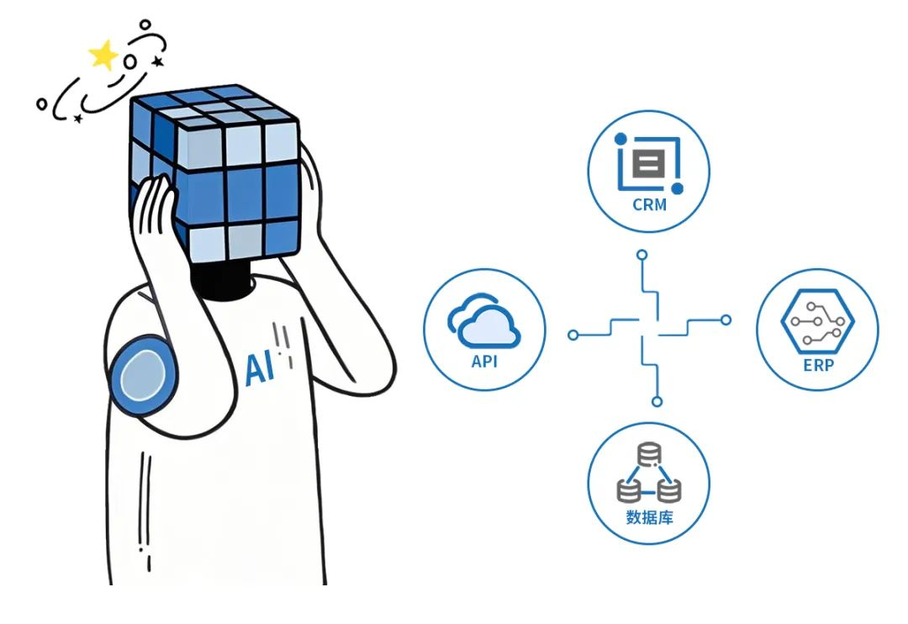
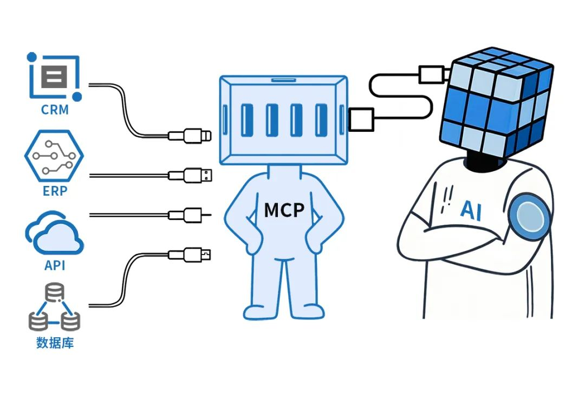
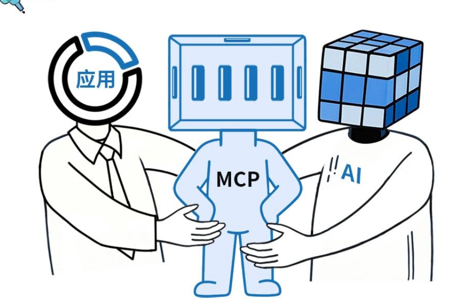
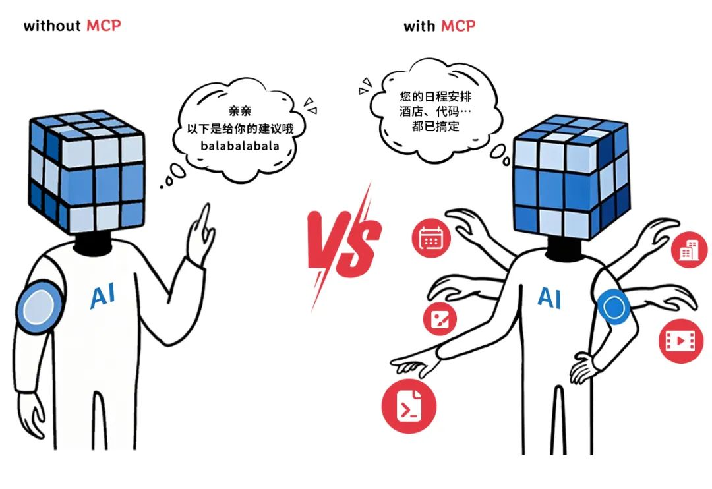
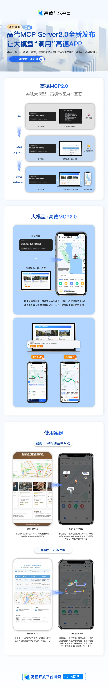

# MCP

## 前置概念
- LLM（Large Language Model，大型语言模型）是指一种基于深度学习的自然语言处理模型，具有大规模的参数和训练数据，能够生成、理解和处理自然语言文本。LLM 在各种任务中表现出色，如文本生成、翻译、问答等。
- Prompt Engineering 是一种通过设计和优化输入提示（prompt）来引导 LLM 生成所需输出的技术。它涉及到对模型输入的精确控制，以提高模型在特定任务上的性能。
- Function Call 是 LLM 的一种功能，允许模型在生成文本时调用预定义的函数或 API，以获取额外的信息或执行特定的操作。这种机制可以增强模型的能力，使其能够处理更复杂的任务。
- Claude 是 Anthropic 开发的一款大型语言模型，旨在提供安全、可靠和高效的自然语言处理能力。Claude 具有强大的文本生成和理解能力，适用于各种应用场景，如对话系统、文本分析等。
- Agent 是一种基于 LLM 的智能体，能够自主执行任务、获取信息和与用户进行交互。它可以通过调用外部 API、访问数据库等方式来增强其功能和智能水平。

## 快速开始
<!-- MCP link -->
[MCP 是什么，怎么回事](http://localhost:8111/video/yt_mcp.mp4)

## 概念
MCP （Model Context Protocol，模型上下文协议）定义了应用程序和 AI 模型之间交换上下文信息的方式。这使得开发者能够以一致的方式将各种数据源、工具和功能连接到 AI 模型（一个中间协议层），就像 USB-C 让不同设备能够通过相同的接口连接一样。MCP 的目标是创建一个通用标准，使 AI 应用程序的开发和集成变得更加简单和统一。

<!-- 下面添加图片 -->


MCP 就是以更标准的方式让 LLM Chat 使用不同工具，更简单的可视化如下图所示，这样你应该更容易理解“中间协议层”的概念了。Anthropic 旨在实现 LLM Tool Call 的标准。


## 选择理由
MCP 的出现是 prompt engineering 发展的产物。更结构化的上下文信息对模型的 performance 提升是显著的。我们在构造 prompt 时，希望能提供一些更 specific 的信息（比如本地文件，数据库，一些网络实时信息等）给模型，这样模型更容易理解真实场景中的问题。


### 对于AI应用程序用户
MCP 意味着您的 AI 应用程序可以访问您每天使用的信息和工具，从而提供更强大的帮助。AI 不再局限于其已知的知识，现在它可以理解您的特定文档、数据和工作环境。

例如，通过使用 MCP 服务器，应用程序可以从 Google Drive 访问您的个人文档或从 ​​GitHub 访问有关您的代码库的数据，从而提供更加个性化和上下文相关的帮助。

想象一下询问人工智能助手：“总结上周的团队会议记录并安排与每个人的后续会议。”

通过使用由 MCP 提供支持的数据源连接，AI 助手可以：

- 通过 MCP 服务器连接到您的 Google Drive 来阅读会议记录
- 根据笔记了解谁需要跟进
- 通过另一个 MCP 服务器连接到您的日历以自动安排会议

### 对于开发人员
在构建需要访问各种数据源的 AI 应用程序时，MCP 可以缩短开发时间并降低开发复杂性。借助 MCP，开发者可以专注于构建卓越的 AI 体验，而无需重复创建自定义连接器。

传统上，将应用程序与数据源连接起来需要为每个数据源和每个应用程序构建自定义的一次性连接。这造成了大量重复工作——每个想要将其 AI 应用程序连接到 Google Drive 或 Slack 的开发人员都需要自行构建连接。

MCP 简化了这一过程，它允许开发者为数据源构建 MCP 服务器，并让各种应用程序可以重复使用。例如，使用开源的 Google Drive MCP 服务器，许多不同的应用程序都可以访问 Google Drive 中的数据，而无需每个开发者都构建自定义连接。

这种 MCP 服务器的开源生态系统意味着开发人员可以利用现有工作，而不是从头开始，从而更容易构建强大的 AI 应用程序，并与用户已经依赖的工具和数据源无缝集成。








### 架构解构


MCP 由三个核心组件构成：Host、Client 和 Server。

`结合案例理解说明`

假设你正在使用 Claude Desktop (Host) 询问："我桌面上有哪些文档？"

Host：Claude Desktop 作为 Host，负责接收你的提问并与 Claude 模型交互。

Client：当 Claude 模型决定需要访问你的文件系统时，Host 中内置的 MCP Client 会被激活。这个 Client 负责与适当的 MCP Server 建立连接。

Server：在这个例子中，文件系统 MCP Server 会被调用。它负责执行实际的文件扫描操作，访问你的桌面目录，并返回找到的文档列表。

整个流程是这样的：你的问题 → Claude Desktop(Host) → Claude 模型 → 需要文件信息 → MCP Client 连接 → 文件系统 MCP Server → 执行操作 → 返回结果 → Claude 生成回答 → 显示在 Claude Desktop 上。

这种架构设计使得 Claude 可以在不同场景下灵活调用各种工具和数据源，而开发者只需专注于开发对应的 MCP Server，无需关心 Host 和 Client 的实现细节。


### 原理详解
`Claude（模型）是在什么时候确定使用哪些工具的`

当用户提出一个问题时：
- 客户端（Claude Desktop / Cursor）将你的问题发送给 
- Claude。Claude 分析可用的工具，并决定使用哪一个（或多个）。
- 客户端通过 MCP Server 执行所选的工具。
- 工具的执行结果被送回给 Claude。
- Claude 结合执行结果构造最终的 prompt 并生成自然语言的回应。
- 回应最终展示给用户！


#### 模型如何选择工具

```python
 async def start(self):
     # 初始化所有的 mcp server
     for server in self.servers:
         await server.initialize()
 ​
     # 获取所有的 tools 命名为 all_tools
     all_tools = []
     for server in self.servers:
         tools = await server.list_tools()
         all_tools.extend(tools)
 ​
     # 将所有的 tools 的功能描述格式化成字符串供 LLM 使用
     # tool.format_for_llm() 我放到了这段代码最后，方便阅读。
     tools_description = "\n".join(
         [tool.format_for_llm() for tool in all_tools]
     )
 ​
     # 这里就不简化了，以供参考，实际上就是基于 prompt 和当前所有工具的信息
     # 询问 LLM（Claude） 应该使用哪些工具。
     system_message = (
         "You are a helpful assistant with access to these tools:\n\n"
         f"{tools_description}\n"
         "Choose the appropriate tool based on the user's question. "
         "If no tool is needed, reply directly.\n\n"
         "IMPORTANT: When you need to use a tool, you must ONLY respond with "
         "the exact JSON object format below, nothing else:\n"
         "{\n"
         '    "tool": "tool-name",\n'
         '    "arguments": {\n'
         '        "argument-name": "value"\n'
         "    }\n"
         "}\n\n"
         "After receiving a tool's response:\n"
         "1. Transform the raw data into a natural, conversational response\n"
         "2. Keep responses concise but informative\n"
         "3. Focus on the most relevant information\n"
         "4. Use appropriate context from the user's question\n"
         "5. Avoid simply repeating the raw data\n\n"
         "Please use only the tools that are explicitly defined above."
     )
     messages = [{"role": "system", "content": system_message}]
 ​
     while True:
         # Final... 假设这里已经处理了用户消息输入.
         messages.append({"role": "user", "content": user_input})
 ​
         # 将 system_message 和用户消息输入一起发送给 LLM
         llm_response = self.llm_client.get_response(messages)
 ​
     ... # 后面和确定使用哪些工具无关
     
 ​
 class Tool:
     """Represents a tool with its properties and formatting."""
 ​
     def __init__(
         self, name: str, description: str, input_schema: dict[str, Any]
     ) -> None:
         self.name: str = name
         self.description: str = description
         self.input_schema: dict[str, Any] = input_schema
 ​
     # 把工具的名字 / 工具的用途（description）和工具所需要的参数（args_desc）转化为文本
     def format_for_llm(self) -> str:
         """Format tool information for LLM.
 ​
         Returns:
             A formatted string describing the tool.
         """
         args_desc = []
         if "properties" in self.input_schema:
             for param_name, param_info in self.input_schema["properties"].items():
                 arg_desc = (
                     f"- {param_name}: {param_info.get('description', 'No description')}"
                 )
                 if param_name in self.input_schema.get("required", []):
                     arg_desc += " (required)"
                 args_desc.append(arg_desc)
 ​
         return f"""
            Tool: {self.name}
            Description: {self.description}
            Arguments:
            {chr(10).join(args_desc)}

```

其中 模型是通过 prompt engineering，即提供所有工具的结构化描述和 few-shot 的 example 来确定该使用哪些工具。另一方面，Anthropic 肯定对 Claude 做了专门的训练（毕竟是自家协议，Claude 更能理解工具的 prompt 以及输出结构化的 tool call json 代码）

#### 工具执行与结果反馈机制
把 system prompt（指令与工具调用描述）和用户消息一起发送给模型，然后接收模型的回复。当模型分析用户请求后，它会决定是否需要调用工具：

- 无需工具时：模型直接生成自然语言回复。
- 需要工具时：模型输出结构化 JSON 格式的工具调用请求。

## 总结
`MCP (Model Context Protocol) 代表了 AI 与外部工具和数据交互的标准建立`

- MCP 的本质: 一个统一的协议标准，使 AI 模型能够以一致的方式连接各种数据源和工具，类似于 AI 世界的"USB-C"接口
- MCP 的价值: 解决了传统 function call 的平台依赖问题，提供了更统一、开放、安全、灵活的工具调用机制，让用户和开发者都能从中受益。
- 使用与开发: 对于普通用户，MCP 提供了丰富的现成工具，用户可以在不了解任何技术细节的情况下使用；对于开发者，MCP 提供了清晰的架构和 SDK，使工具开发变得相对简单。


### 应用前景
- 智能化开发工作流：AI 助手可以更深入地参与到开发流程中，自动化执行测试、部署等任务
- 数据分析与可视化：AI 助手可以直接访问数据库，生成分析报告和可视化结果
- 跨平台自动化：统一的协议使 AI 助手能够操作不同平台和工具
- 个性化智能助手：用户可以配置自己的 MCP 服务器，创建专属于自己工作流的 AI 助手

### 优势
1. 统一标准，打破“私有协议困局”
传统AI工具调用依赖厂商私有协议（如GPT-4的Function Call），导致重复开发适配逻辑。
MCP通过JSON-RPC 2.0协议兼容主流大模型（GPT、Claude等），实现“一次开发，全平台通用”。

2. 降低开发成本，加速落地
MCP的“即插即用”特性大幅减少重复开发成本

3. 动态扩展，适应复杂场景
MCP支持动态加载新工具和服务。例如，当接入新型基因测序仪时，无需修改核心代码即可扩展癌症易感性分析功能

### 落地场景
1. 电商与支付
百度构建“电商智能体”，AI助手可直接调用库存数据库、商品评价系统和支付接口，实现“从对话到下单”的全流程自动化。李彦宏称MCP为“电商的万能插座”。

2. 出行与地图
高德MCP 2.0通过专属地图工具，将出行规划、导航启动、酒店推荐等步骤从6次操作缩减为“一键完成”，并与高德APP联动，成为“真正的出行秘书”。


3. 内容创作
MCP+Cursor等AI写作工具可自动提取文章金句并生成配图。例如，即梦MCP一次生成几十张候选海报，成本降低90%，效率提升百倍

4. 工业与制造
MCP驱动的数字孪生系统，可将自然语言指令（如“设计续航800公里的SUV”）转化为工程图纸，设计迭代次数提升8倍。

### 生态发展
- OpenAI、谷歌、微软、亚马逊均宣布支持MCP。

- 阿里云魔搭社区上线千款MCP服务， 百度智能云千帆平台全面兼容MCP，腾讯位置服务推出MCP Server