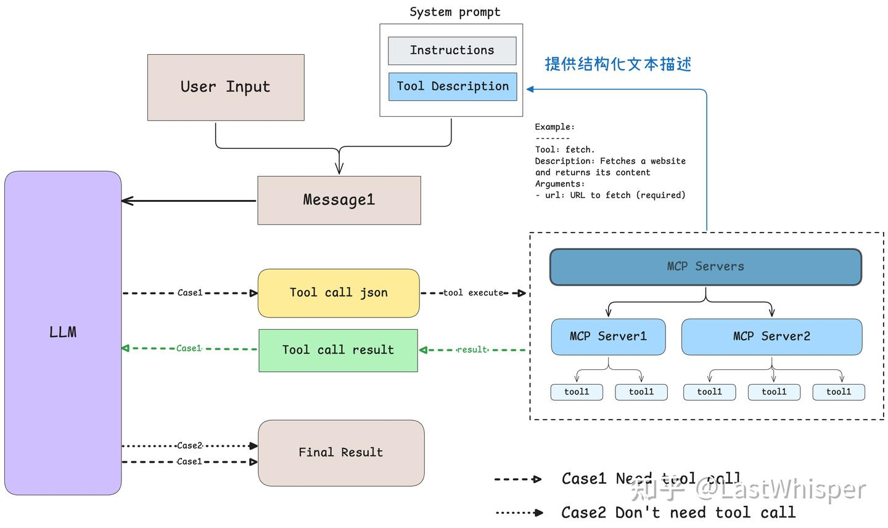

# MCP

## 前置概念
- LLM（Large Language Model，大型语言模型）是指一种基于深度学习的自然语言处理模型，具有大规模的参数和训练数据，能够生成、理解和处理自然语言文本。LLM 在各种任务中表现出色，如文本生成、翻译、问答等。
- Prompt Engineering 是一种通过设计和优化输入提示（prompt）来引导 LLM 生成所需输出的技术。它涉及到对模型输入的精确控制，以提高模型在特定任务上的性能。
- Function Call 是 LLM 的一种功能，允许模型在生成文本时调用预定义的函数或 API，以获取额外的信息或执行特定的操作。这种机制可以增强模型的能力，使其能够处理更复杂的任务。
- Claude 是 Anthropic 开发的一款大型语言模型，旨在提供安全、可靠和高效的自然语言处理能力。Claude 具有强大的文本生成和理解能力，适用于各种应用场景，如对话系统、文本分析等。
- Agent 是一种基于 LLM 的智能体，能够自主执行任务、获取信息和与用户进行交互。它可以通过调用外部 API、访问数据库等方式来增强其功能和智能水平。

## 快速开始
<!-- MCP link -->
[MCP 是什么，怎么回事](https://www.youtube.com/watch?v=_d0duu3dED4)

## 概念
MCP （Model Context Protocol，模型上下文协议）定义了应用程序和 AI 模型之间交换上下文信息的方式。这使得开发者能够以一致的方式将各种数据源、工具和功能连接到 AI 模型（一个中间协议层），就像 USB-C 让不同设备能够通过相同的接口连接一样。MCP 的目标是创建一个通用标准，使 AI 应用程序的开发和集成变得更加简单和统一。

<!-- 下面添加图片 -->


MCP 就是以更标准的方式让 LLM Chat 使用不同工具，更简单的可视化如下图所示，这样你应该更容易理解“中间协议层”的概念了。Anthropic 旨在实现 LLM Tool Call 的标准。


## 选择理由
MCP 的出现是 prompt engineering 发展的产物。更结构化的上下文信息对模型的 performance 提升是显著的。我们在构造 prompt 时，希望能提供一些更 specific 的信息（比如本地文件，数据库，一些网络实时信息等）给模型，这样模型更容易理解真实场景中的问题。

没有 MCP 之前，我们可能会人工从数据库中筛选或者使用工具检索可能需要的信息，手动的粘贴到 prompt 中。随着我们要解决的问题越来越复杂，手工把信息引入到 prompt 中会变得越来越困难。

为了克服手工 prompt 的局限性，许多 LLM 平台（如 OpenAI、Google）引入了 function call 功能。这一机制允许模型在需要时调用预定义的函数来获取数据或执行操作，显著提升了自动化水平。

但  function call 平台依赖性强，不同 LLM 平台的 function call API 实现差异较大。例如，OpenAI 的函数调用方式与 Google 的不兼容，开发者在切换模型时需要重写代码，增加了适配成本。除此之外，还有安全性，交互性等问题。

数据与工具本身是客观存在的，只不过我们希望将数据连接到模型的这个环节可以更智能更统一。Anthropic 基于这样的痛点设计了 MCP，充当 AI 模型的"万能转接头"，让 LLM 能轻松的获取数据或者调用工具。更具体的说 MCP 的优势在于：
- 生态 - MCP 提供很多现成的插件，你的 AI 可以直接使用。
- 统一性 - 不限制于特定的 AI 模型，任何支持 MCP 的模型都可以灵活切换。
- 数据安全 - 你的敏感数据留在自己的电脑上，不必全部上传。（因为我们可以自行设计接口确定传输哪些数据）

### 架构解构


MCP 由三个核心组件构成：Host、Client 和 Server。

`结合案例理解说明`

假设你正在使用 Claude Desktop (Host) 询问："我桌面上有哪些文档？"Host：Claude Desktop 作为 Host，负责接收你的提问并与 Claude 模型交互。Client：当 Claude 模型决定需要访问你的文件系统时，Host 中内置的 MCP Client 会被激活。这个 Client 负责与适当的 MCP Server 建立连接。Server：在这个例子中，文件系统 MCP Server 会被调用。它负责执行实际的文件扫描操作，访问你的桌面目录，并返回找到的文档列表。整个流程是这样的：你的问题 → Claude Desktop(Host) → Claude 模型 → 需要文件信息 → MCP Client 连接 → 文件系统 MCP Server → 执行操作 → 返回结果 → Claude 生成回答 → 显示在 Claude Desktop 上。

这种架构设计使得 Claude 可以在不同场景下灵活调用各种工具和数据源，而开发者只需专注于开发对应的 MCP Server，无需关心 Host 和 Client 的实现细节。


### 原理详解
`Claude（模型）是在什么时候确定使用哪些工具的`

当用户提出一个问题时：
- 客户端（Claude Desktop / Cursor）将你的问题发送给 
- Claude。Claude 分析可用的工具，并决定使用哪一个（或多个）。
- 客户端通过 MCP Server 执行所选的工具。
- 工具的执行结果被送回给 Claude。
- Claude 结合执行结果构造最终的 prompt 并生成自然语言的回应。
- 回应最终展示给用户！



#### 模型如何选择工具

作者：LastWhisper
链接：https://zhuanlan.zhihu.com/p/29001189476
来源：知乎
著作权归作者所有。商业转载请联系作者获得授权，非商业转载请注明出处。

```python
 async def start(self):
     # 初始化所有的 mcp server
     for server in self.servers:
         await server.initialize()
 ​
     # 获取所有的 tools 命名为 all_tools
     all_tools = []
     for server in self.servers:
         tools = await server.list_tools()
         all_tools.extend(tools)
 ​
     # 将所有的 tools 的功能描述格式化成字符串供 LLM 使用
     # tool.format_for_llm() 我放到了这段代码最后，方便阅读。
     tools_description = "\n".join(
         [tool.format_for_llm() for tool in all_tools]
     )
 ​
     # 这里就不简化了，以供参考，实际上就是基于 prompt 和当前所有工具的信息
     # 询问 LLM（Claude） 应该使用哪些工具。
     system_message = (
         "You are a helpful assistant with access to these tools:\n\n"
         f"{tools_description}\n"
         "Choose the appropriate tool based on the user's question. "
         "If no tool is needed, reply directly.\n\n"
         "IMPORTANT: When you need to use a tool, you must ONLY respond with "
         "the exact JSON object format below, nothing else:\n"
         "{\n"
         '    "tool": "tool-name",\n'
         '    "arguments": {\n'
         '        "argument-name": "value"\n'
         "    }\n"
         "}\n\n"
         "After receiving a tool's response:\n"
         "1. Transform the raw data into a natural, conversational response\n"
         "2. Keep responses concise but informative\n"
         "3. Focus on the most relevant information\n"
         "4. Use appropriate context from the user's question\n"
         "5. Avoid simply repeating the raw data\n\n"
         "Please use only the tools that are explicitly defined above."
     )
     messages = [{"role": "system", "content": system_message}]
 ​
     while True:
         # Final... 假设这里已经处理了用户消息输入.
         messages.append({"role": "user", "content": user_input})
 ​
         # 将 system_message 和用户消息输入一起发送给 LLM
         llm_response = self.llm_client.get_response(messages)
 ​
     ... # 后面和确定使用哪些工具无关
     
 ​
 class Tool:
     """Represents a tool with its properties and formatting."""
 ​
     def __init__(
         self, name: str, description: str, input_schema: dict[str, Any]
     ) -> None:
         self.name: str = name
         self.description: str = description
         self.input_schema: dict[str, Any] = input_schema
 ​
     # 把工具的名字 / 工具的用途（description）和工具所需要的参数（args_desc）转化为文本
     def format_for_llm(self) -> str:
         """Format tool information for LLM.
 ​
         Returns:
             A formatted string describing the tool.
         """
         args_desc = []
         if "properties" in self.input_schema:
             for param_name, param_info in self.input_schema["properties"].items():
                 arg_desc = (
                     f"- {param_name}: {param_info.get('description', 'No description')}"
                 )
                 if param_name in self.input_schema.get("required", []):
                     arg_desc += " (required)"
                 args_desc.append(arg_desc)
 ​
         return f"""
 Tool: {self.name}
 Description: {self.description}
 Arguments:
 {chr(10).join(args_desc)}


   @classmethod
   def from_function(
      cls,
      fn: Callable,
      name: str | None = None,
      description: str | None = None,
      context_kwarg: str | None = None,
   ) -> "Tool":
      """Create a Tool from a function."""
      func_name = name or fn.__name__ # 获取函数名
   ​
      if func_name == "<lambda>":
            raise ValueError("You must provide a name for lambda functions")
   ​
      func_doc = description or fn.__doc__ or "" # 获取函数 docstring
      is_async = inspect.iscoroutinefunction(fn)
      
 ```

其中 模型是通过 prompt engineering，即提供所有工具的结构化描述和 few-shot 的 example 来确定该使用哪些工具。另一方面，Anthropic 肯定对 Claude 做了专门的训练（毕竟是自家协议，Claude 更能理解工具的 prompt 以及输出结构化的 tool call json 代码）

#### 工具执行与结果反馈机制
把 system prompt（指令与工具调用描述）和用户消息一起发送给模型，然后接收模型的回复。当模型分析用户请求后，它会决定是否需要调用工具：

- 无需工具时：模型直接生成自然语言回复。
- 需要工具时：模型输出结构化 JSON 格式的工具调用请求。

如果回复中包含结构化 JSON 格式的工具调用请求，则客户端会根据这个 json 代码执行对应的工具。

如果模型执行了 tool call，则工具执行的结果 result 会和 system prompt 和用户消息一起重新发送给模型，请求模型生成最终回复。

如果 tool call 的 json 代码存在问题或者模型产生了幻觉怎么办呢？通过阅读代码 发现，我们会 skip 掉无效的调用请求。

执行相关的代码与注释如下：
```python

async def start(self):
     ... # 上面已经介绍过了，模型如何选择工具
 ​
     while True:
         # 假设这里已经处理了用户消息输入.
         messages.append({"role": "user", "content": user_input})
 ​
         # 获取 LLM 的输出
         llm_response = self.llm_client.get_response(messages)
 ​
         # 处理 LLM 的输出（如果有 tool call 则执行对应的工具）
         result = await self.process_llm_response(llm_response)
 ​
         # 如果 result 与 llm_response 不同，说明执行了 tool call （有额外信息了）
         # 则将 tool call 的结果重新发送给 LLM 进行处理。
         if result != llm_response:
             messages.append({"role": "assistant", "content": llm_response})
             messages.append({"role": "system", "content": result})
 ​
             final_response = self.llm_client.get_response(messages)
             logging.info("\nFinal response: %s", final_response)
             messages.append(
                 {"role": "assistant", "content": final_response}
             )
         # 否则代表没有执行 tool call，则直接将 LLM 的输出返回给用户。
         else:
             messages.append({"role": "assistant", "content": llm_response})
```
## 总结
`MCP (Model Context Protocol) 代表了 AI 与外部工具和数据交互的标准建立`

- MCP 的本质: 一个统一的协议标准，使 AI 模型能够以一致的方式连接各种数据源和工具，类似于 AI 世界的"USB-C"接口
- MCP 的价值: 解决了传统 function call 的平台依赖问题，提供了更统一、开放、安全、灵活的工具调用机制，让用户和开发者都能从中受益。
- 使用与开发: 对于普通用户，MCP 提供了丰富的现成工具，用户可以在不了解任何技术细节的情况下使用；对于开发者，MCP 提供了清晰的架构和 SDK，使工具开发变得相对简单。
