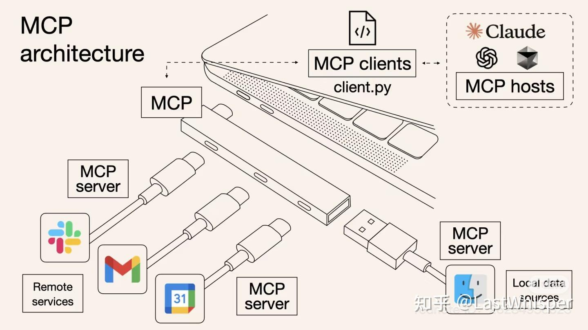

# MCP

## 快速开始
<!-- MCP link -->
[MCP](https://www.youtube.com/watch?v=_d0duu3dED4)

## Concept
MCP （Model Context Protocol，模型上下文协议）定义了应用程序和 AI 模型之间交换上下文信息的方式。这使得开发者能够以一致的方式将各种数据源、工具和功能连接到 AI 模型（一个中间协议层），就像 USB-C 让不同设备能够通过相同的接口连接一样。MCP 的目标是创建一个通用标准，使 AI 应用程序的开发和集成变得更加简单和统一。

<!-- 下面添加图片 -->

MCP 就是以更标准的方式让 LLM Chat 使用不同工具，更简单的可视化如下图所示，这样你应该更容易理解“中间协议层”的概念了。Anthropic 旨在实现 LLM Tool Call 的标准。

